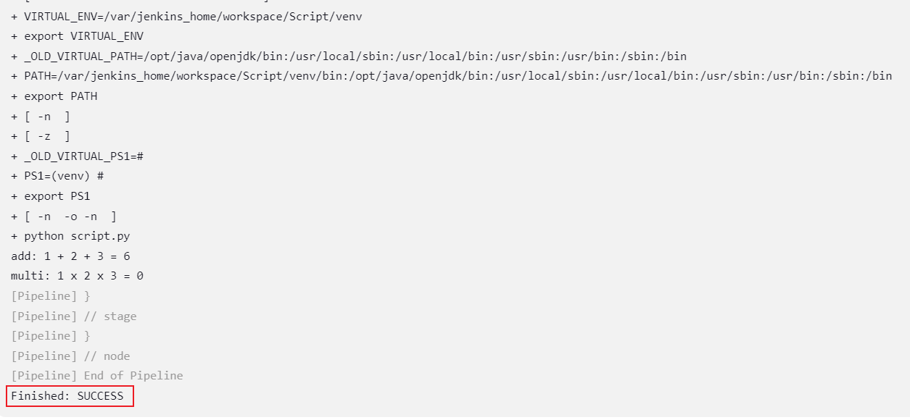

# 介绍
用于 CI/CD 测试

# Jenkins
## 内部部署
### 解释器
1. 基于 Jenkins 容器所在服务器，需要在容器中手动安装 python 解释器，及 pip
    ```text
    agent any
    ```
2. 基于主机中 docker 的 python 镜像，需要打通 jenkins 容器与主机的 docker 之间的通信。

    `建议镜像：jenkinsci/blueocean ，无需在容器中再次安装docker`
    ```text
   agent {
       docker {
           image 'python:3.7-slim-buster'
       }
   }
    ```
   **注**：jenkins 容器中使用主机的 docker：需要在启动 jenkins 容器之前挂载 docker 的相关引擎至 jenkins 容器中
   ```text
   # 主机为 Linux
   -v /var/run/docker.sock:/var/run/docker.sock \
   -v /var/run/docker:/var/run/docker
   ```
3. 基于主机中的 python 解释器
<br>TODO

### 示例
* app 应用
   ```text
   pipeline {
       agent any
   
       stages{
           stage("pull codebuild checkout") {
               steps {
                   git branch: "main", url: "https://github.com/fevolq/PyCICD.git"
               }
           }
   
           stage("setup environment") {
               steps {
                   sh "python -m venv venv"
                   sh ". venv/bin/activate && pip install -r requirements.txt"
               }
           }
   
           stage("start project") {
               steps {
                   script {
                       def startCmd = '. venv/bin/activate && uwsgi -d --ini app.ini'
                       def reloadCmd = '. venv/bin/activate && uwsgi --reload app.pid'
                       def reloadResult = sh script: reloadCmd, returnStatus: true
                       
                       if (reloadResult == 0) {
                           echo 'Reload successful.'
                       } else {
                           echo 'Reload failed. Starting the project...'
                           sh script: startCmd
                           echo 'Started successful.'
                       }
                   }
               }
           }
       }
   }
   ```
* 脚本
   ```text
   pipeline {
       agent any
   
       stages{
           stage("pull codebuild checkout") {
               steps {
                   git branch: "main", url: "https://github.com/fevolq/PyCICD.git"
               }
           }
   
           stage("setup environment") {
               steps {
                   sh "python -m venv venv"
                   sh ". venv/bin/activate && pip install -r requirements.txt"
               }
           }
   
           stage("start project") {
               steps {
                   sh ". venv/bin/activate && python script.py"
               }
           }
       }
   }
   ```
   